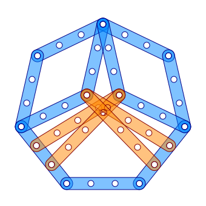

# Meccano
Meccano geometry experiments.

## Inspiration
Gerard ’t Hooft meccano mathematics:
- [meccano.pdf](https://webspace.science.uu.nl/~hooft101/lectures/meccano.pdf)
- [meccano2.pdf](https://webspace.science.uu.nl/~hooft101/lectures/meccano2.pdf)
- [meccano3.pdf](https://webspace.science.uu.nl/~hooft101/lectures/meccano3.pdf)

## Regular polygons

### Simple

|  |  | 
|----|---|----|

### [Pentagons](penta/README.md)
|  | 
|----|----

### [Heptagons](hepta/README.md)

### [Octagon](octa/README.md)

## Braced polygons

### Squares

|  | 
|---|---

### Starred

|  | 
|---|---

### Nonagon

