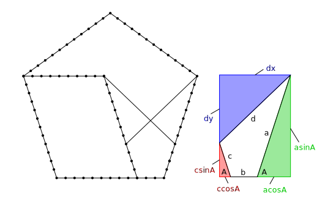

# Meccano pentagons

To identify a pentagon we use two angles _A_ and _B_:

&nbsp;&nbsp;&nbsp;&nbsp;[](eqs/1.tex)

## Pentagon of type 1



A pentagon of type 1 has three rods (or sections of rods) 
**a**, **b** and **c** at fixed angles with integer sizes.

We want to find a fourth rod **d** with integer size too to make the pentagon of type 1.

We start by looking relations with other rods: 

&nbsp;&nbsp;&nbsp;&nbsp;[](eqs/2.tex)

We define two variables **m** and **n**. **m** is the sum of all terms multipled by **sqrt(5)** while **n** is the sum of all the terms not multipled by **sqrt(5)**:

&nbsp;&nbsp;&nbsp;&nbsp;[](eqs/3.tex)

Simplifyng:

&nbsp;&nbsp;&nbsp;&nbsp;[](eqs/4.tex)

We can do **m = 0** by doing **ac = (a + c)b** and all the terms with sqrt(5) goes away.

Finally we get two equations:

&nbsp;&nbsp;&nbsp;&nbsp;[](eqs/5.tex)

Now, a program use the equations and iterate over the integer values
of **a**, **b** and **c** to check if generated **d** is an integer too.

Next javascript program was run and found a single solution *`a = 12, b = 3, c = 4, d = 11`* after 5000 iterations. Scaled solutions are discared as are repetitions.

```
function meccano_pentagons_1(sols)
{
  this.find = (max)=> {
    for (let a=1; a < max; a++)
      for (let b=1; b <= max; b++)
        for (let c=0; c <= a; c++)
          if (a*c == (a + c)*b)
            mZero(a, b, c)
  }
  const mZero = (a, b, c)=> {
    const d = Math.sqrt(a*a + b*b + c*c - a*c)
    if (d > 0 && d % 1 === 0)
      dInteger(a, b, c, d)
  }
  const dInteger = (a, b, c, d) => {
    for (let i=0; i < sols.length; i++) {
      const s = sols[i]
      if (a % s.a == 0) {
        const f = a / s.a
        const bS = (b % s.b == 0) && b / s.b == f
        const cS = (c % s.c == 0) && c / s.c == f
        const dS = (d % s.d == 0) && d / s.d == f
        if (bS && cS && dS)
          return // scaled solution already
      }
    }
    sols.push({ a:a, b:b, c:c, d:d }) // solution!
  }
}

```

The single solution of pentagon type 1:


## Pentagons type 2

