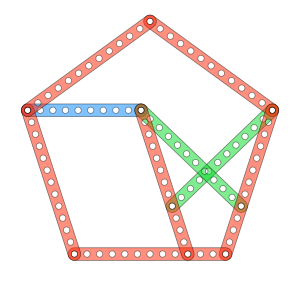

# Meccano pentagons

To identify a pentagon we use two angles _A_ and _B_.
Some identities are solved for sqrt(5) values and will be used next.

| &nbsp;&nbsp;&nbsp;&nbsp; |
|-------------|
| [equations 1](eqs/1.tex) |

## Pentagon of type 1

A pentagon of type 1 is defined in the next figure.
We identify in this type, three rods (or sections of rods) 
**a**, **b** and **c** at fixed angles with integer sizes as for any meccano figure.
We want to find a fourth rod **d** with integer size too to make the pentagon.
Actually, the pentagon shown is the unique solved so far for small values.


We start by looking the formulas to relate the rods:

|  |
|-------------|
| [equations 2](eqs/2.tex) |

We define two variables **m** and **n**. **m** is the sum of all terms multipled by **sqrt(5)** while **n** is the sum of all the terms not multipled by **sqrt(5)**:

|  |
|-------------|
| [equations 3](eqs/3.tex) |

Simplifying, we get a value of rod **d<sup>2</sup>** in fuction of the rest of rods:

|  |
|-------------|
| [equations 4](eqs/4.tex) |

Now, we want rod **d<sup>2</sup>** to be as simple as possible so is good idea to set **m = 0**
which requires **ac = (a + c)b**. 

This way rod **d** is a function of **a**, **b** and **c**:

|  |
|-------------|
| [equations 5](eqs/5.tex) |

### Pentagon type 1 search

With equations 5, a program can iterate over the integer values
of **a**, **b** and **c** to discover **d** as integer too.
Next javascript program was run and found a single solution *`a = 12, b = 3, c = 4, d = 11`* after 5000 iterations. Scaled solutions are discared as are repetitions.

```
function meccano_pentagons_1(sols)
{
  this.find = (max)=> {
    for (let a=1; a < max; a++)
      for (let b=1; b <= max; b++)
        for (let c=0; c <= a; c++)
          if (a*c == (a + c)*b)
            mZero(a, b, c)
  }
  const mZero = (a, b, c)=> {
    const d = Math.sqrt(a*a + b*b + c*c - a*c)
    if (d > 0 && d % 1 === 0)
      dInteger(a, b, c, d)
  }
  const dInteger = (a, b, c, d) => {
    for (let i=0; i < sols.length; i++) {
      const s = sols[i]
      if (a % s.a == 0) {
        const f = a / s.a
        const bS = (b % s.b == 0) && b / s.b == f
        const cS = (c % s.c == 0) && c / s.c == f
        const dS = (d % s.d == 0) && d / s.d == f
        if (bS && cS && dS)
          return // scaled solution already
      }
    }
    sols.push({ a:a, b:b, c:c, d:d }) // solution!
  }
}

```

|  |
|---------------|
| The smallest pentagon type 1 &nbsp;&nbsp; [**a** = 12](pentagon-12a.svg) |


## Pentagon of type 2

A pentagon of type 2 is defined in next figure.
We identify in this type four rods (or sections of rods) **a**, **b**, **c**, and **d**
at fixed angles.
We want to find a fifth rod **e** to make this pentagon.
Actually, the image below is the smallest of this type 
`a=12 b=2 c=9 d=6 e=11` and for each solution are two
versions whether the green rods are used or the blue ones.


We start with the rods relations formulas:

|  |
|-------------|
| [equations 6](eqs/6.tex) |

As in the type 1 case, we define variables **m** and **n**:

|  |
|-------------|
| [equations 7](eqs/7.tex) |

Simplifying, we get a value of rod **e<sup>2</sup>** in fuction of the rest of rods:

|  |
|-------------|
| [equations 8](eqs/8.tex) |

As in type 1 case we set **m = 0** which now requires **cd = (a - b)(c - d) + ab**. 

This way rod **e** is a function of **a**, **b**, **c** and **d**:

|  |
|-------------|
| [equations 9](eqs/9.tex) |

### Pentagon type 2 search

With equations 9, another program for pentagon type 2, can iterate over the integer values
of **a**, **b**, **c** and **d** to discover **e** as integer too.
Next javascript program was run and found 40 different pentagons with rods size <= 183.

```
function meccano_pentagons_2(sols)
{
  this.find = (max) => {
    for (let a=1; a < max; a++) {
      for (let b=1; b < a; b++)
        for (let c=1; c < a; c++)
          for (let d=1; d < a; d++)
            if ((a - b)*(c - d) + a*b == c*d)
              mZero(a, b, c, d)
    }
  }
  const mZero = (a, b, c, d)=> {
    const e = Math.sqrt(a*a + b*b + c*c + d*d - a*d - b*c - c*d)
    if (e > 0 && e % 1 === 0)
      eInteger(a, b, c, d, e)
  }
  const eInteger = (a, b, c, d, e)=> {
    for (let i=0; i < sols.length; i++) {
      const s = sols[i]
      if (a % s.a == 0) {
        const f = a / s.a
        const bS = (b % s.b == 0) && b / s.b == f
        const cS = (c % s.c == 0) && c / s.c == f
        const dS = (d % s.d == 0) && d / s.d == f
        const eS = (e % s.e == 0) && e / s.e == f
        if (bS && cS && dS && eS)
          return // scaled solution already
      }
    }
    sols.push( { a:a, b:b, c:c, d:d, e:e }) // solution
  }
}
```

### Pentagons type 2 examples

|  |
|--------------------|
| Pentagon type 2 &nbsp;&nbsp; [**a** = **e** = 31](pentagons-2-31.svg) |

|  |
|--------------------|
| Pentagon type 2 &nbsp;&nbsp; [**a** = 38](pentagons-2-38.svg) |

|  |
|--------------------|
| Pentagon type 2 &nbsp;&nbsp; [**a** = 48](pentagons-2-48.svg) |